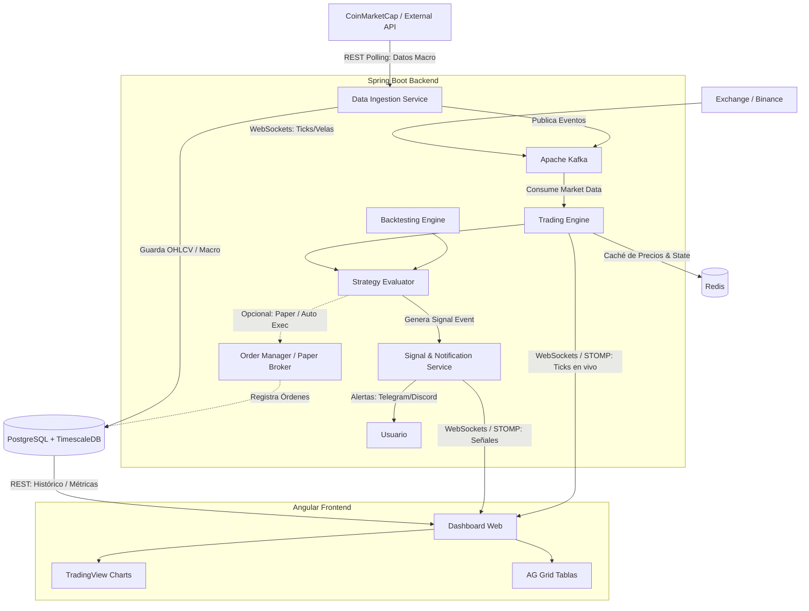

# Roadmap: Plataforma de Trading Algorítmico y Backtesting

Este documento define la hoja de ruta arquitectónica y las fases de implementación para el motor de trading y
backtesting. El sistema está construido con una arquitectura orientada a eventos (Event-Driven), diseñada para procesar
datos de alta frecuencia, generar señales asistidas y evaluar estrategias en tiempo real o en diferido.

## Arquitectura del Sistema

---

## Fase 1: Infraestructura y Configuración Base

- [x] **Configurar Entorno Dockerizado:**
    - Crear `docker-compose.yml` incluyendo: TimescaleDB (PG16), Apache Kafka + ZooKeeper y Redis.
- [x] **Inicializar Backend (Spring Boot 4.1.1 + Java 21):**
    - Configurar dependencias: Spring WebMVC, Spring Data JPA, Spring for Apache Kafka, Spring Data Redis, WebSocket,
      Lombok.
    - Diseñar la estructura de paquetes basada en Arquitectura Hexagonal (Domain, Application, Infrastructure).
- [ ] **Inicializar Frontend (Angular):**
    - Crear el workspace de Angular.
    - Configurar Angular Material y dependencias clave: `lightweight-charts` (TradingView), `ag-grid-angular`,
      `@stomp/rx-stomp`.
- [ ] **Configuración de Base de Datos:**
    - Configurar conexión JPA a PostgreSQL / TimescaleDB.
    - Ejecutar scripts de migración (Flyway/Liquibase) para habilitar TimescaleDB y crear hypertables para datos OHLCV
      (Open, High, Low, Close, Volume).

## Fase 2: Ingesta Multi-Fuente y Modelado de Dominio

- [ ] **Modelado del Dominio Principal:**
    - Crear entidades de dominio: `Tick`, `Candle (OHLCV)`, `TradingSignal`, `MacroData`, `Position`, `Portfolio`.
- [ ] **Conexión a Exchanges (Tiempo Real):**
    - Implementar cliente WebSocket para conectarse al feed público de Binance y escuchar ticks/velas en tiempo real.
- [ ] **Conexión a APIs Macro (Largo Plazo):**
    - Implementar conector/ingestador con *polling* programado para CoinMarketCap (Market Cap, dominancia BTC,
      rankings).
- [ ] **Pipeline de Eventos (Kafka):**
    - Configurar productores que publiquen eventos normalizados en topics dedicados (`market.ticks`, `market.macro`).
    - Configurar consumidores desacoplados usando `group.id` independientes.
- [ ] **Persistencia y Caché Dual:**
    - Almacenar series temporales históricas en TimescaleDB.
    - Guardar el estado actual del mercado (últimos precios, métricas macro) en Redis para acceso con latencia mínima.

## Fase 3: Motor de Eventos, Estrategias y Señales Asistidas

- [ ] **Interfaces de Estrategia e Indicadores:**
    - Definir la interfaz `TradingStrategy` con el método `evaluate(...)`.
    - Implementar factoría de indicadores técnicos (Simple Moving Average, RSI, MACD).
- [ ] **Evaluador de Estrategias en Tiempo Real:**
    - Conectar el evaluador a los topics de Kafka (`market.ticks` y `market.macro`).
    - Procesar eventos y evaluar condiciones de entrada/salida.
- [ ] **Servicio de Señales y Notificaciones (Modo Asistido):**
    - Generar eventos `trading-signals` enriquecidos (precio, Stop-Loss, Take-Profit, temporalidad).
    - Dispatcher de alertas a bots de Telegram/Discord y al Dashboard vía WebSockets/STOMP.
- [ ] **Módulo Extensible de Ejecución (Opcional / Paper Trading):**
    - Diseñar la interfaz del ejecutor para poder conmutar en el futuro entre *Paper Trading* (broker simulado) y
      ejecución directa vía API.

## Fase 4: Módulo de Backtesting

- [ ] **Orquestador de Simulación:**
    - Crear un servicio que consulte rangos históricos de velas desde TimescaleDB.
    - Inyectar las velas secuencialmente en el `Trading Engine` simulando el paso del tiempo.
- [ ] **Cálculo de Métricas Financieras:**
    - Generar reportes analíticos al finalizar la simulación.
    - Métricas: Total Return (PnL), Maximum Drawdown, Win Rate, Profit Factor, Sharpe Ratio.
- [ ] **API REST de Exposición:**
    - Endpoints para listar estrategias, ejecutar backtests asíncronos y recuperar históricos de resultados.

## Fase 5: Interfaz Visual en Tiempo Real (Angular)

- [ ] **Estructura de Servicios y RxJS:**
    - Servicios para API REST y suscripciones STOMP/WebSocket vía `RxStomp` para flujos en vivo.
- [ ] **Integración de Gráficos (TradingView Canvas):**
    - Componente contenedor para `lightweight-charts`.
    - Carga inicial vía REST y actualización dinámica de la última vela mediante WebSockets.
    - Renderizado visual de señales (flechas de BUY/SELL y niveles de SL/TP) sobre el gráfico.

## Fase 6: Dashboard Integral y Cierre

- [ ] **Implementación de Tablas de Alto Rendimiento:**
    - Integrar `ag-grid` para visualizar el Historial de Señales emitidas y estado del Portfolio simulado.
- [ ] **Panel de Backtesting:**
    - Formularios de configuración (parámetros de estrategia, rango de fechas, capital inicial).
    - Visualización gráfica de la curva de capital (*Equity Curve*) y KPI financieros.
- [ ] **Optimización y Refactorización Final:**
    - Estrategias de Change Detection (`OnPush`) en Angular.
    - Pulido de estilos y UI (Material Theming).