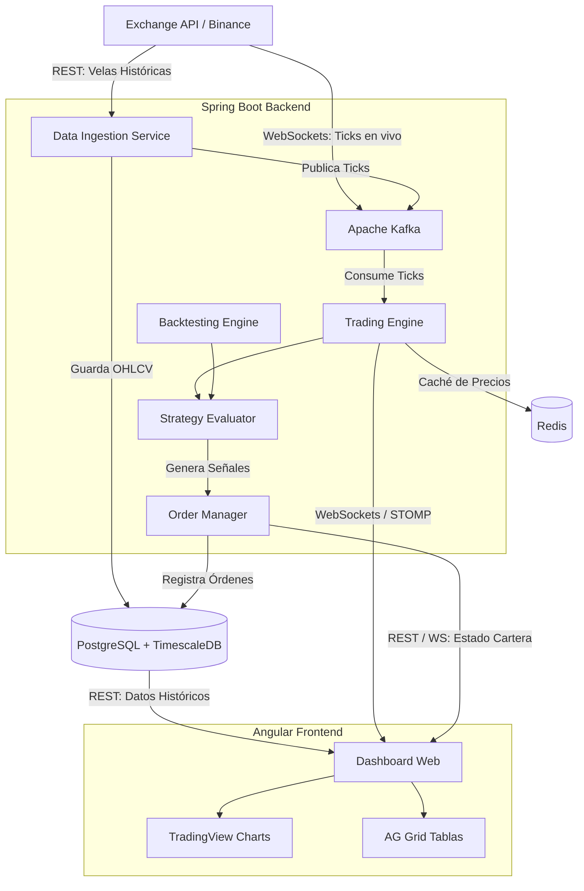

# Roadmap: Plataforma de Trading Algorítmico y Backtesting

Este documento define la hoja de ruta arquitectónica y las fases de implementación para el motor de trading y backtesting. El sistema está construido con una arquitectura orientada a eventos, diseñada para manejar datos en serie temporal de alta frecuencia y evaluar estrategias de inversión en tiempo real.

## Arquitectura del Sistema

---

## Fase 1: Infraestructura y Configuración Base

- [ ] **Configurar Entorno Dockerizado:**
    - Crear `docker-compose.yml` incluyendo: PostgreSQL (con extensión TimescaleDB), Apache Kafka / Zookeeper y Redis.
- [ ] **Inicializar Backend (Spring Boot 3.x):**
    - Configurar dependencias: Spring Web, Spring Data JPA, Spring for Apache Kafka, Spring Data Redis, WebSocket, Lombok.
    - Diseñar la estructura de paquetes basada en Arquitectura Hexagonal (Domain, Application, Infrastructure).
- [ ] **Inicializar Frontend (Angular):**
    - Crear el workspace de Angular.
    - Configurar Angular Material y dependencias clave: `lightweight-charts` (TradingView), `ag-grid-angular`, `@stomp/rx-stomp`.
- [ ] **Configuración de Base de Datos:**
    - Configurar conexión JPA a PostgreSQL.
    - Ejecutar scripts de migración (Flyway/Liquibase) para habilitar TimescaleDB y crear las hypertables para datos OHLCV (Open, High, Low, Close, Volume).

## Fase 2: Ingesta de Datos y Modelado de Dominio

- [ ] **Modelado del Dominio Principal:**
    - Crear entidades de dominio: `Tick`, `Candle (OHLCV)`, `Order`, `Position`, `Portfolio`.
- [ ] **Conexión a Exchange Externa:**
    - Implementar cliente WebSocket para conectarse al feed público de Binance (o similar) y escuchar ticks de precios en tiempo real.
- [ ] **Pipeline de Eventos (Kafka):**
    - Configurar un Productor de Kafka que reciba los ticks del Exchange y los publique en un topic (ej. `market.ticks`).
    - Configurar un Consumidor de Kafka en el backend que escuche este topic.
- [ ] **Persistencia de Series Temporales:**
    - Implementar repositorios para almacenar los datos en TimescaleDB.
    - Desarrollar la lógica para agrupar `Ticks` en velas `OHLCV` (1m, 5m, 1h) usando funciones de agregación continuas de la base de datos o en memoria.

## Fase 3: Motor de Trading y Estrategias

- [ ] **Interfaces de Estrategia e Indicadores:**
    - Definir la interfaz `TradingStrategy` con el método `evaluate(Candle[] history)`.
    - Implementar una factoría de indicadores técnicos (ej. Media Móvil Simple, RSI).
- [ ] **Evaluador de Estrategias en Tiempo Real:**
    - Conectar el Consumidor de Kafka al Motor de Trading.
    - Cada vez que se cierra una vela, inyectar el historial en la estrategia activa y evaluar condiciones de entrada/salida.
- [ ] **Gestor de Órdenes (Paper Trading):**
    - Implementar la lógica para simular ejecuciones de órdenes (Market, Limit, Stop Loss).
    - Gestionar el saldo virtual del `Portfolio` y registrar las transacciones en base de datos.
    - Mantener el estado en tiempo real de las posiciones abiertas en Redis para acceso ultra rápido.

## Fase 4: Módulo de Backtesting

- [ ] **Orquestador de Simulación:**
    - Crear un servicio que consulte un rango histórico de velas desde TimescaleDB.
    - Inyectar las velas secuencialmente en el `Trading Engine`, simulando el paso del tiempo.
- [ ] **Cálculo de Métricas Financieras:**
    - Desarrollar el generador de reportes de finalización de simulación.
    - Calcular métricas: Total Return (PnL), Maximum Drawdown, Win Rate, Sharpe Ratio.
- [ ] **API REST de Exposición:**
    - Crear endpoints para listar configuraciones de estrategias, lanzar backtests asíncronos y recuperar los resultados de simulaciones previas.

## Fase 5: Interfaz Visual en Tiempo Real (Angular)

- [ ] **Estructura de Servicios y RxJS:**
    - Implementar servicios para la conexión API REST.
    - Configurar la conexión STOMP/WebSocket usando `RxStomp` para manejar flujos de datos en tiempo real (ticks, actualizaciones de órdenes).
- [ ] **Integración de Gráficos (TradingView Canvas):**
    - Crear componente contenedor para `lightweight-charts`.
    - Cargar histórico inicial vía REST y actualizar la última vela dinámicamente mediante la suscripción WebSocket.
    - Renderizar marcadores visuales (flechas de BUY/SELL) sobre el gráfico según las señales recibidas.

## Fase 6: Dashboard Integral y Cierre

- [ ] **Implementación de Tablas de Alto Rendimiento:**
    - Integrar `ag-grid` para visualizar el Historial de Órdenes y Posiciones Abiertas.
    - Configurar actualizaciones reactivas de celdas (para el PnL no realizado).
- [ ] **Panel de Backtesting:**
    - Crear formularios de configuración de estrategias (selección de parámetros, fechas, capital inicial).
    - Componente de visualización de resultados (curva de capital/Equity Curve y KPI financieros).
- [ ] **Optimización y Refactorización Final:**
    - Revisar estrategias de Change Detection (`OnPush`) en Angular para evitar cuellos de botella en la renderización.
    - Afinar manejo de memoria y limpieza de suscripciones.
    - Pulir diseño global (Material Theming).